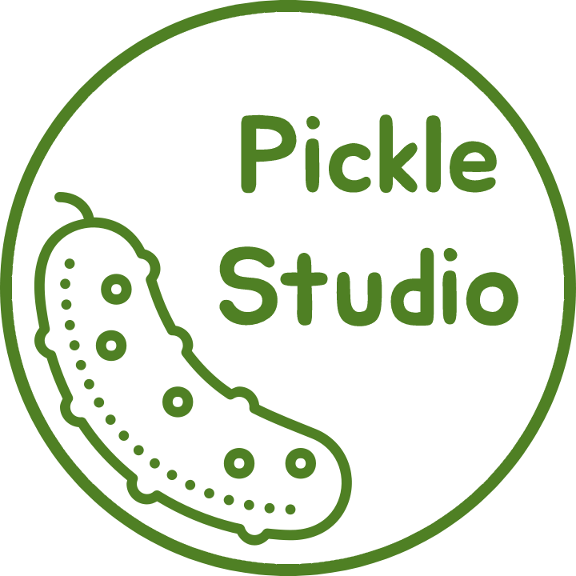
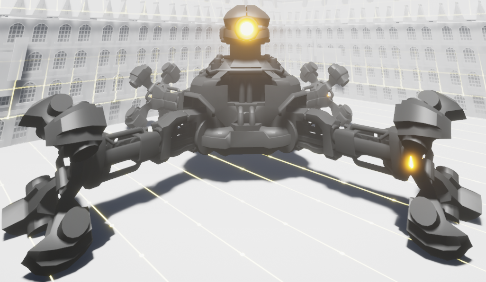
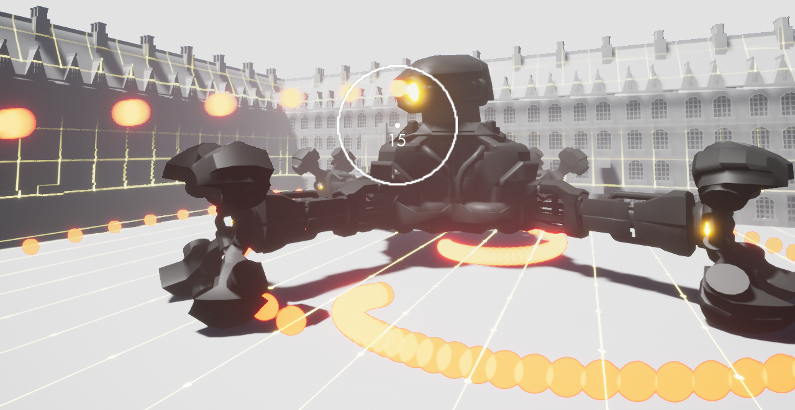
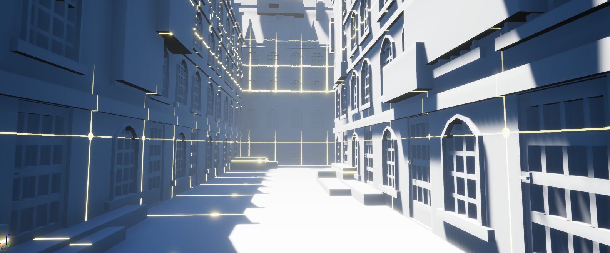
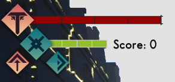
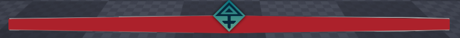

# **Unreal TPS - Twilight Archery**

## **Project information**
Trello: [Twilight Archery Trello](https://trello.com/b/5qpmZN9g/twilight-archery)  
Game Design Document: [GDD](https://docs.google.com/document/d/1alyK2vPHPSm90NmQqsHbEGwX5jF0s-t6WQVCs1JFY18/edit)

Project by the **Pickle Studio**, composed of Rémi Serra, Maël Jammet, Nino Masseteau and Julien Bertrand.  
This is a school project made in ISART Digital Paris.  

 
  

The goal was to make a **Third Person Shooter**, with gameplay inspired by **Monster Hunter** and split screen local multiplayer on **Nintendo Switch**.
 

## **Gameplay**
In **Twilight Archery** the two players must kill a large and very dangerous robotic monster that is threatening the simulation they live in: the **CTHULHUBOT-MK120**.  
Players have to fight this threat with bow and arrows. 
The robot has many dreadful attacks that all involve shooting projectiles at the players. It does have weaknesses though:
- 4 weakpoints on his arms
- 1 weakpoint on his eye

  

Players can perform many different actions:
- Walking
- Jumping
- Sprinting
- Dashing
- Superjumping

## **Level Design**

## **UI**

  

